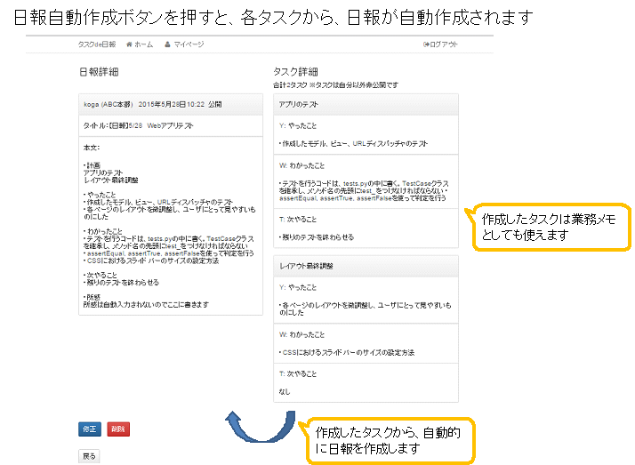

タスクde日報
===========

このアプリは、日報作成のためのWebアプリ「タスクde日報」です。
一日のタスクを管理でき、それを日報に反映できます。

※　nippou_proj/settings.pyは諸事情のため.gitignoreしてます。リリース時に追加します

## イメージ図




## 特長
このアプリの特長は以下の通りです。

1. P/YWT（計画、やったこと、わかったこと、つぎやること）モデルに沿ったタスクの生成機能  
1日の終わりに日報を書くときには既に1日何をしたか、忘れてしまったということ、ありませんか？このアプリは、1日の中の各タスクについて個別に管理できます。各タスクで業務前にPを、業務中にYWを、業務後にTを書き込むことで、効果的に予実差、理解度や不明点などの振り返りを行えるようになっています。

2. 日報自動生成機能  
日報作成のために1日の終わりに膨大な量のタスクを振り返るのは辛くありませんか？もしP/YWTモデルに沿ってタスクを作成しておけば、複数のタスクを自動的に１枚の日報に変換してくれます。あなたが書くことは、その日報に次やることと所感だけです。

3. 自分だけの業務メモツール  
業務で必要になった、細々したメモはすぐに忘れてしまうものです。しかし、後日また必要になったりして悔しい思いをしたことありませんか？そんなときはタスクde日報のタスクをメモツールとして活用しましょう。そうすれば、後日いつでも振り返られます。この内容は自分だけが見ることができます。


## 機能
 * 日報作成に必須の基本的な機能（投稿、編集、削除、検索、一覧／個別表示）
 * ユーザ認証機能（ログイン・ログアウト）
 * 他ユーザの日報表示
 * P/YWT（計画、やったこと、わかったこと、つぎやること）モデルに沿ったタスクの生成機能
 * 日報自動生成機能
 * 自分だけの業務メモツール
  
以下の機能は現在、未実装です（順次追加予定）
  
 * ユーザ追加機能
 * ユーザ情報（名前、所属など）の閲覧、変更機能
 * マイページで各日のタスクリスト閲覧（現在は最新日のみタスクのリストアップ可）
 * 最新日のタスク以外のタスク編集機能
 * コメント機能
 * Markdown, Wiki形式出力機能

ぜひ追加したい新機能は以下の通りです。
* 各タスクの要約や、大項目のみを抽出して日報作成に反映する機能


## バージョン情報
v0.1 2015/5/29　新規作成

## ライセンス
未定

実行環境
===========
* Windows 7
* Python 3.4.3
* Django 1.8.2
* PostgreSQL 9.4
  
Pythonモジュール

* psycopg2（PostgresSQLのドライバ）
* bootstrap-form
* bootstrap-toolkit


準備
===========

## DB作成
PostgreSQLのデータベーステーブルを、Djangoのmanage.pyを使って作成します。
nippou_projディレクトリに移動し、以下のコマンドを実行して、マイグレーションを行います。

```bash

python manage.py migrate


```

これで、PostgreSQLのデータベースにこのアプリで使うテーブルが作成されました。

# ユーザ作成
以下のコマンドでユーザを作成してください。ユーザ名、メアド（空でも可）、パスワードは適当なものを入力してください。


```bash

python manage.py createsuperuser

```

# ユーザ情報の入力
* このステップは行わなくてもアプリは動きますが、やっておくとユーザ情報が正しく表示されますのでお勧めです。

1. 下の「実行方法」に従って、アプリを起動しておく
2. http://127.0.0.1:8000/adminにアクセス
3. ユーザ作成時に決めたID,パスワードでログイン
4. Nippou_Appの「ユーザ」をクリックし、自分のユーザ名をクリック
5. 姓／名と一番下の所属を入力
6. 保存をクリック


実行方法
===========

```python

python manage.py runserver 8000

```

以下のように出力されれば正常に起動しています。

```bash

Performing system checks...

System check identified no issues (0 silenced).
May 27, 2015 - 20:21:21
Django version 1.8.2, using settings 'nippou_proj.settings'
Starting development server at http://127.0.0.1:8000/
Quit the server with CONTROL-C.

```


アプリ利用方法
========
## ログイン
1. http://127.0.0.1:8000/nippou_app にWebブラウザでアクセスし、ユーザ作成時に決めたID,パスワードでログインしてください
2. ログインに成功すれば、サイトトップページに移ります。ユーザ名が左上に表示されていることを確認してください

## 日報作成手順
### タスクから自動作成しない方法
1. トップページの左上にある、「日報新規作成」をクリック
2. タイトル、本文を入力し、「公開」にチェックが入っていることを確認します
3. 確定ボタンを押して、完成です。トップページに作成した日報が表示されます。

### タスクから自動作成する方法
1. トップページの左上にある、「日報新規作成」をクリック
2. タイトル、本文を入力し（とりあえず、作成中など）、「公開」にチェックが入っていないことを確認します
3. マイページで2.で作成した日報の、タスク追加をクリックして、タスクを作成します。タスクはいくつでも追加できます。
4. 作成したタスクに、タスク名、Y：やったこと、W：わかったこと、T：次やることなどを書き込みます（業務中がおすすめ）
5. 終業時など日報作成時に、マイページの自動日報作成ボタンを押して、日報のひな形を作ります。
6. ひな形に修正を加えて、「公開」にチェックを入れ、確定ボタンを押します。トップページに作成した日報が表示されます。


